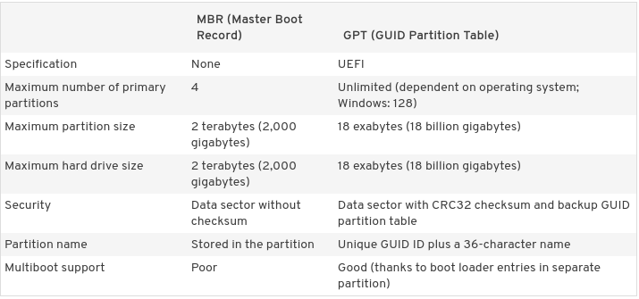

# POP OS Manual Disk partitioning 


## Technologies 

* Vmware Workstation
* UEFI (Unified Extensible Firmware Interface)
* qGPT GUID Partition Table (GPT) disks
* LVM2
* FAT32
* EXT4
* POP os 20.10


## Create POP OS VM

setup the vm with UEFI capability 


## Boot To VM


### Checking EFI


Check if boot as EFI or BIOS to create a pratition table acorrdingly 

```bash
$ mount | grep efi 
# output 
efivarfs on /sys/firmware/efi/efivars ---snip---
```


### Partition the Disk

GPT: GUID Partition Table (GPT) disks use Unified Extensible Firmware Interface ([UEFI](https://www.howtogeek.com/56958/htg-explains-how-uefi-will-replace-the-bios/)),One advantage of GPT disks is that you can have more than four partitions on each disk




Partition the  Disk using `parted` program:

```bash
parted /dev/sda

mklabel gpt

mkpart EFI fat32 1 2049 
mkpart Recovery fat32 2049 6145
mkpart SystemData ext4 6145
print

set 1 bios_grub on
set 1 esp on 

```

For `parted` command flags like esp, bios_grub you can find more with this [link](https://www.gnu.org/software/parted/manual/html_node/set.html)


Create a LVM2 layout 

```bash
pvcreate /dev/sda3
vgcreate vg_systemdata /dev/sda3
lvcreate vg_systemdata -n lv_swap -L 4G
lvcreate vg_systemdata -n lv_root -l 100%FREE
```


```python
#!/usr/bin/env python3
# -*- coding: utf-8 -*-

# ref: https://github.com/i3/i3status/blob/master/contrib/wrapper.py
#
# To use it, ensure your ~/.i3status.conf contains this line:
#     output_format = "i3bar"
# in the 'general' section.
# Then, in your ~/.i3/config, use:
#     status_command i3status | ~/i3status/contrib/wrapper.py
# In the 'bar' section.

import sys, subprocess
import json

def gpu_info():
    return subprocess.getoutput('nvidia-smi --query-gpu=gpu_name,pstate,utilization.gpu,utilization.memory,temperature.gpu --format=csv,noheader').strip()

def print_line(message):
    """ Non-buffered printing to stdout. """
    sys.stdout.write(message + '\n')
    sys.stdout.flush()

def read_line():
    """ Interrupted respecting reader for stdin. """
    # try reading a line, removing any extra whitespace
    try:
        line = sys.stdin.readline().strip()
        # i3status sends EOF, or an empty line
        if not line:
            sys.exit(3)
        return line
    # exit on ctrl-c
    except KeyboardInterrupt:
        sys.exit()

if __name__ == '__main__':
    # Skip the first line which contains the version header.
    print_line(read_line())

    # The second line contains the start of the infinite array.
    print_line(read_line())

    while True:
        line, prefix = read_line(), ''
        # ignore comma at start of lines
        if line.startswith(','):
            line, prefix = line[1:], ','

        j = json.loads(line)
        # insert information into the start of the json, but could be anywhere
        # CHANGE THIS LINE TO INSERT SOMETHING ELSE
        j.insert(0, {
            'full_text': gpu_info().strip().replace(',', '') + ' °C',
            'name': 'gpu',
            'color': '#3A85FF'
        })
        # and echo back new encoded json
        print_line(prefix+json.dumps(j))
```


